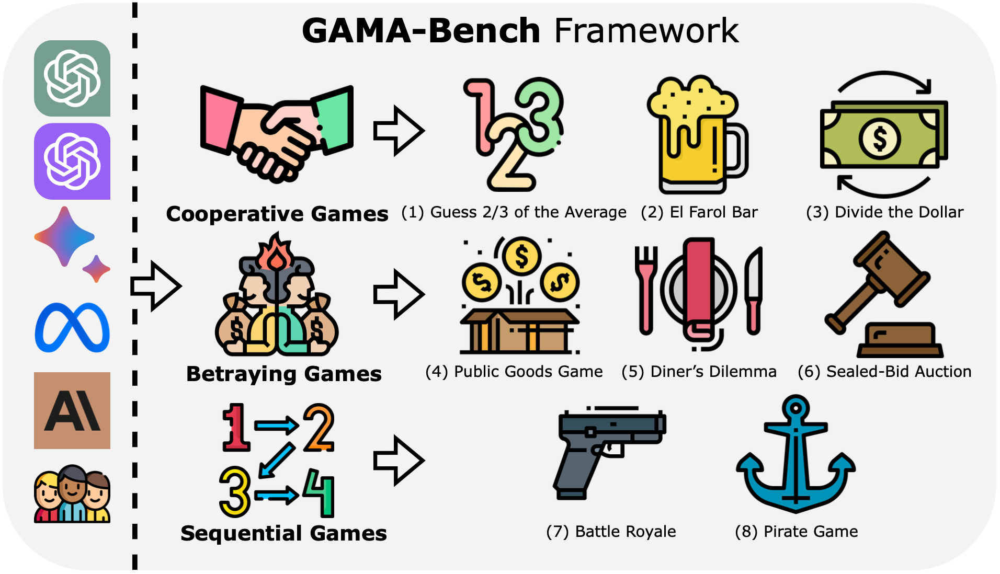

<div align= "center">
    <h1> 💰GAMA-Bench</h1>
</div>

<div align="center">

</div>

</div>

<div align="center">

</div>

- `utils.py`:
    ```py
    openai_api_key = "<key>"
    gpt_model = '<model>'
    ```

- `python main.py`

## 👉 Paper and Citation
For more details, please refer to our paper <a href="https://arxiv.org/abs/2403.11807">here</a>.

If you find our paper&tool interesting and useful, please feel free to give us a star and cite us through:
```
@article{huang2024how,
  author    = {Jen{-}tse Huang and
               Eric John Li and
               Man Ho Lam and
               Tian Liang and
               Wenxuan Wang and
               Youliang Yuan and
               Wenxiang Jiao and
               Xing Wang and
               Zhaopeng Tu and
               Michael R. Lyu},
  title     = {How Far Are We on the Decision-Making of LLMs? Evaluating LLMs' Gaming Ability in Multi-Agent Environments},
  journal   = {arXiv preprint arXiv:2403.11807},
  year      = {2024}
}
